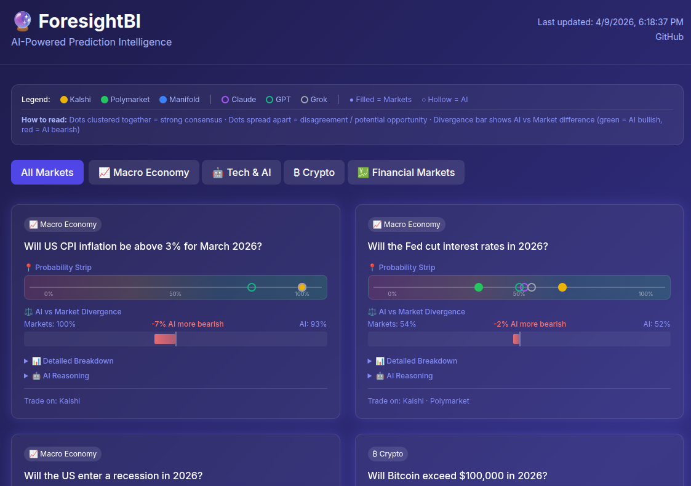

# 🔮 ForesightBI — AI-Powered Prediction Intelligence

A dashboard that aggregates selected common projections from several prediction markets and compares them to AI probability estimates, highlighting divergences for business intelligence. What's included depends on existance of similar opportunities, (and the clarity and ease with which such opporutnities can be easily seen as similar), so there may be a small number of comparisons.

The idea is to see if there's signficant divergence and then judge if such disparities represent an opportunity or not. Or just consider a composite score.



# ⚠️ Disclaimer

This is an unofficial, personal project and is not affiliated with, endorsed by, or connected to any of the services used here in any way. Use at your own risk. The author is not responsible for any financial losses or issues arising from use of this software. Moreover, this was built with an OpenClaw bot and Claude. So the author takes even less responsibility, as in NONE for any use of this code.

## Features

- 📊 **Multi-Source Aggregation** — Pulls from Kalshi, Polymarket, and Manifold Markets
- 🤖 **Multi-AI Analysis** — Claude, GPT-3.5, and Grok generate independent probability estimates
- ⚖️ **Weighted Composite** — Real-money markets weighted higher (Kalshi 3x, Polymarket 2x, Manifold 1x)
- 📍 **Dot Strip Visualization** — See all estimates at a glance on a 0-100% scale
- ⚡ **Divergence Detection** — Highlights when AI consensus disagrees with market composite
- 📱 **Beautiful Dashboard** — Dark theme, responsive, no build step required

## 🚀 Quick Setup Guide

### Step 1: Download the Code

**Option A: Using Git (Recommended)**
Good option if you already have git installed on your computer and can use terminal mode.
```bash
git clone https://github.com/ScottGsHub/foresight-bi.git
cd foresight-bi
```

**Option B: Download ZIP**
1. Go to https://github.com/ScottGsHub/foresight-bi
2. Click the green "Code" button → "Download ZIP"
3. Extract the ZIP file and open Terminal in that folder

### Step 2: Get Your API Keys

You'll need at least one AI provider API key. **Claude is recommended** for best results:

Note that settings files and places to get API keys can change with various providers. If these specific instructions don't get you to the API section with your providers, look in places like Profiles, Settings, Security and similar to find where to make API keys. Remember that most of these can show you an API key once, and then they don't show it again. So you should copy them into a password manager or someplaces for safe keeping.

#### 🧠 Claude (Anthropic) - **RECOMMENDED**
1. Go to https://console.anthropic.com
2. Sign up for an account
3. Click "Get API Key" or visit https://console.anthropic.com/settings/keys
4. Click "Create Key", give it a name like "ForesightBI"
5. Copy the key (starts with `sk-ant-`)

#### 💬 ChatGPT (OpenAI) - Optional
1. Go to https://platform.openai.com/api-keys
2. Sign up/log in to your OpenAI account
3. Click "Create new secret key"
4. Copy the key (starts with `sk-`)

#### 🤖 Grok (xAI) - Optional
1. Go to https://console.x.ai
2. Sign up with your X/Twitter account
3. Generate an API key
4. Copy the key

### Step 3: Configure Your Keys
The instrucions below are generally for using terminal window type text editors. The other option that works for most people is to use a plain text editor on the files themselves. It's important that you use a simple, plain text editor though, not a word processor that likey inserts special characters and codes.

1. **Copy the template file:**
   ```bash
   cp .env.example .env
   ```

2. **Edit the .env file:**
   ```bash
   # On Mac/Linux:
   nano .env
   
   # Or use any text editor:
   open .env
   ```

3. **Add your API keys:**
   ```bash
   # Required (at least one AI provider):
   ANTHROPIC_API_KEY=sk-ant-your-key-here

   # Optional but recommended for richer comparisons:
   OPENAI_API_KEY=sk-your-openai-key-here
   XAI_API_KEY=your-xai-key-here

   # Optional: Metaculus integration (get token at metaculus.com/accounts/settings/)
   METACULUS_TOKEN=your-token-here
   ```

4. **Save and close** the file

### Step 4: Test the Setup

No `npm install` needed — the scripts use only built-in Node.js modules.

1. **Fetch market data:**
   ```bash
   node scripts/fetch-markets.js
   ```
   
   ✅ **Success:** You should see market prices fetched for each entry in `data/markets.json`
   
   ❌ **Error?** See troubleshooting below

2. **Generate AI analysis:**
   ```bash
   node scripts/generate-ai.js
   ```
   
   ✅ **Success:** You should see probability estimates from each AI provider

### Step 5: View the Dashboard

**Option A: Simple (just open the file)**
```bash
# Mac:
open index.html

# Linux:
xdg-open index.html

# Windows:
start index.html
```

**Option B: Local server (recommended for full features)**
```bash
npx http-server -p 8080 -c-1
```
Then visit http://localhost:8080 in your browser

### Step 6: Keep It Updated

To get fresh data, run these commands periodically:

```bash
# Get latest market prices
node scripts/fetch-markets.js

# Get fresh AI analysis  
node scripts/generate-ai.js

# Refresh your browser to see updates
```

**Pro tip:** Set up a simple cron job to auto-update:
```bash
# Run every 6 hours
0 */6 * * * cd /path/to/foresight-bi && node scripts/fetch-markets.js && node scripts/generate-ai.js
```

## Project Structure

```
foresight-bi/
├── data/
│   ├── markets.json        # Market definitions (edit to add/remove)
│   ├── latest.json         # Latest market snapshot
│   ├── ai-analysis.json    # AI probability estimates
│   ├── dashboard.json      # Combined data for frontend
│   └── snapshots/          # Historical data by date
├── scripts/
│   ├── fetch-markets.js    # Fetch from prediction markets
│   └── generate-ai.js      # Generate AI estimates
├── index.html              # Dashboard (single file, no build)
└── README.md
```

## Choosing Markets

ForesightBI does **not** auto-discover markets. There is no search or browsing built in — you choose the questions you care about and manually find the matching markets on each platform. The tool then fetches prices and AI estimates for exactly what you've listed.

This is intentional: the value is in *you* picking meaningful, comparable questions across platforms — not in volume.

### What makes a good market to add?

- **Has matches on multiple platforms** — the more platforms have it, the richer the comparison. A question only on one platform gives you nothing to compare.
- **Clear, binary resolution** — "Will X happen by Y date?" works well. Vague or multi-outcome questions are harder to compare.
- **Not already resolved** — check the resolution date before adding.
- **You have a view on it** — divergence is only interesting if you can reason about who might be right.

### Finding tickers and slugs

**Kalshi** (`kalshi_ticker`)
1. Browse [kalshi.com](https://kalshi.com) and find a market
2. The ticker is in the URL and on the market page — looks like `KXCPIYOY-26MAR-T3.2`
3. Copy it exactly

**Polymarket** (`polymarket_slug` + `polymarket_outcome`)
1. Browse [polymarket.com](https://polymarket.com) and find a matching market
2. The slug is the last part of the URL — e.g. `us-recession-by-end-of-2026`
3. Also note the exact outcome label you want (e.g. `"Yes"`) — set this as `polymarket_outcome`

**Manifold** (`manifold_slug`)
1. Browse [manifold.markets](https://manifold.markets) and find a matching market
2. The slug is the `username/market-name` part of the URL — e.g. `will-the-us-enter-a-recession-2-con`
3. Use `null` if no match exists

### Tips

- Use `null` for any platform that doesn't have the market — the tool handles missing sources gracefully
- Start with 3-5 markets to test your setup before adding more
- Markets expire — check your `markets.json` periodically and remove resolved ones

## Adding New Markets

Edit `data/markets.json`:

```json
{
  "id": "my-new-market",
  "question": "Will X happen by Y date?",
  "category": "macro",
  "resolution_date": "2026-12-31",
  "kalshi_ticker": "TICKER-NAME",
  "manifold_slug": "username/market-slug",
  "polymarket_slug": "event-slug",
  "polymarket_outcome": "Yes"
}
```

Use `null` for any platform that doesn't have a matching market. Then re-run the scripts.

## Data Sources

| Source | Type | Weight | Notes |
|--------|------|--------|-------|
| **Kalshi** | Real money | 3x | US-regulated, requires API credentials |
| **Polymarket** | Real money | 2x | Crypto-based, public API |
| **Manifold** | Play money | 1x | Free API, great coverage |

## AI Models

| Model | Provider | Notes |
|-------|----------|-------|
| **Claude** | Anthropic | Primary analysis, strong reasoning |
| **GPT-3.5** | OpenAI | Fast, good baseline |
| **Grok** | xAI | Alternative perspective |

## How It Works

1. **Fetch**: `fetch-markets.js` pulls prices from Kalshi, Polymarket, and Manifold
2. **Analyze**: `generate-ai.js` asks each AI for independent probability estimates
3. **Compare**: Dashboard shows dot strip (all estimates) and divergence bar (AI vs markets)
4. **Decide**: Use insights for research, strategy, or curiosity

## Interpreting the Dashboard

**Dot Strip Chart:**
- Filled dots = Market sources
- Hollow dots = AI models
- Clustered dots = Strong consensus
- Spread dots = Disagreement (potential opportunity)

**Divergence Bar:**
- Green (right) = AI more bullish than markets
- Red (left) = AI more bearish than markets
- Centered = AI and markets agree

## Why This Matters

Prediction markets aggregate crowd wisdom with skin in the game. AI provides independent analysis. When they disagree significantly, it could indicate:

- **Market inefficiency** — a trading opportunity
- **AI blind spot** — the crowd knows something AI doesn't
- **Information asymmetry** — worth investigating further

Neither is always right. The divergence itself is the insight.

## 🔧 Troubleshooting

### "Command not found: node"

**Problem:** Node.js isn't installed

**Fix:**
1. **Mac:** `brew install node` or download from https://nodejs.org
2. **Ubuntu/Debian:** `sudo apt update && sudo apt install nodejs npm`
3. **Windows:** Download from https://nodejs.org
4. **Verify:** `node --version` should show v16 or higher

### "Error: API key not found"

**Problem:** Your .env file isn't set up correctly

**Fix:**
1. Make sure `.env` exists: `ls -la .env`
2. Check the content: `cat .env`
3. Ensure no spaces around the = sign:
   ✅ `ANTHROPIC_API_KEY=sk-ant-123`
   ❌ `ANTHROPIC_API_KEY = sk-ant-123`
4. Make sure the key starts with the right prefix:
   - Anthropic: `sk-ant-`
   - OpenAI: `sk-`
   - xAI: varies

### "Rate limit exceeded" or "Invalid API key"

**Problem:** API key issues

**Fix:**
1. **Double-check your API key** in the provider console
2. **Rate limits:** Wait a few minutes and try again
3. **Billing:** Make sure your account has credits/payment method
4. **Test a single provider:** Comment out other keys in .env

### "No markets found" or "Failed to fetch"

**Problem:** Network or API issues

**Fix:**
1. **Check internet connection**
2. **Try again later** - APIs sometimes have issues
3. **Check if APIs are down:** 
   - Manifold: https://manifold.markets
   - Polymarket: https://polymarket.com
4. **VPN issues:** Some APIs block VPNs

### "localhost refused to connect"

**Problem:** Local server died

**Fix:**

1. **Quick restart:**
   ```bash
   cd /path/to/foresight-bi
   npx http-server -p 8080 -c-1
   ```

2. **Keep server alive after terminal closes:**
   ```bash
   # Using nohup (simple)
   nohup npx http-server -p 8080 -c-1 &
   
   # Using tmux (better)
   tmux new -s foresight
   npx http-server -p 8080 -c-1
   # Press Ctrl+B, then D to detach
   # Reconnect later: tmux attach -t foresight
   ```

3. **Just open the HTML file directly:**
   - Right-click `index.html` → "Open with" → your browser
   - Note: Some features may not work due to CORS restrictions

### "Permission denied" or "EACCES"

**Problem:** File permissions

**Fix:**
```bash
# Make scripts executable
chmod +x scripts/*.js

# Or run with explicit node command
node scripts/fetch-markets.js
```

### "Dashboard shows old data"

**Problem:** Browser caching

**Fix:**
1. **Hard refresh:** Ctrl+Shift+R (or Cmd+Shift+R on Mac)
2. **Clear cache:** Browser settings → Clear browsing data
3. **Disable cache:** F12 → Network tab → "Disable cache" checkbox
4. **Force reload:** Add `?v=123` to the URL

### "Markets showing as N/A"

**Problem:** Market definitions need updating

**Fix:**
1. Edit `data/markets.json`
2. Update `kalshi_ticker`, `manifold_slug`, or `polymarket_slug` fields
3. Use `null` for platforms that don't have the market
4. Re-run `node scripts/fetch-markets.js`

### Still having issues?

1. **Check the logs:** Look for error messages in the terminal
2. **Try minimal setup:** Use only Claude API key, test with one market
3. **File an issue:** https://github.com/ScottGsHub/foresight-bi/issues
4. **Include:**
   - Your operating system
   - Node.js version (`node --version`)
   - The exact error message
   - What you were trying to do

### Performance Tips

- **Start small:** Test with 2-3 markets first
- **Rate limits:** Don't run scripts too frequently (every hour max)
- **API costs:** Claude/GPT cost money per request - monitor usage
- **Local data:** Dashboard works offline once you have `dashboard.json`

## Limitations

- Market coverage varies — not every question has matches on all platforms
- AI estimates are based on training data cutoffs
- Polymarket may be geo-restricted in some regions
- This is not financial advice

## Future Plans Under Consideration

- [ ] Track accuracy over time (who was right?) (Likely using a real database like Supabase instead of flat file history.)
- [ ] Add more markets and categories
- [ ] Email/notification alerts for big divergences
- [ ] Historical divergence trends
- [ ] Scenario explorer (if X, then Y)

## License

MIT — do whatever you want with it.

---

Built with ❤️ using [Kalshi](https://kalshi.com), [Polymarket](https://polymarket.com), [Manifold](https://manifold.markets) + [Claude](https://anthropic.com), [GPT](https://openai.com), [Grok](https://x.ai)
